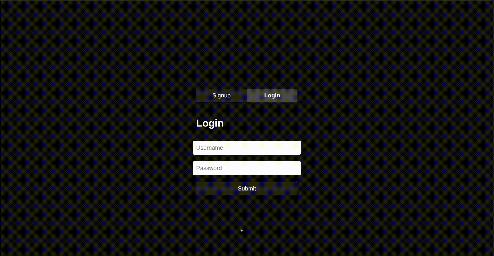

# Web3 Wallet Generator

A beginner-friendly Web3 wallet generator that allows users to create blockchain wallets (Solana, Ethereum, Bitcoin) using mnemonics, manage multiple accounts per coin, and securely store their credentials. Designed for developers and blockchain learners who want a foundational full-stack crypto wallet app.

## Tech Stack

- Frontend: HTML, CSS, JavaScript, Axios
- Backend: Node.js, Express.js
- Database: MongoDB + Mongoose
- Crypto: bip39, tweetnacl, ed25519-hd-key, @solana/web3.js


## Demo



## Features

- Secure user signup & login with password hashing
- Mnemonic generation and encryption using password
- Derive public/private key pairs for Solana, Ethereum, and Bitcoin
- Dynamic wallet generation per coin with account indexing
- Toggle buttons to show/hide private keys and seed phrases
- Token-based user authentication (JWT)
- MongoDB persistence for user data
- Clean, responsive UI with login/signup toggle

## Run Locally

Clone the project

```bash
git clone https://github.com/hawk200545/wallet-gen
```
Go to Project directory 
```bash
cd web3-wallet-generator
```
Install Dependencies 
```bash
npm install
```
Run
```bash
node index.js
```

